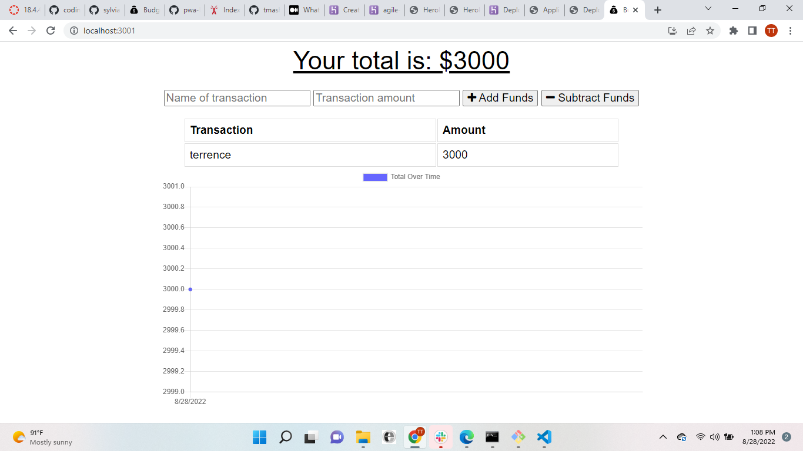

# Budget Tracker Starter Code

## Github Link

[tmashoro](https://github.com/tmashoro/budget-tracker)

## Description

This app gives users a fast and easy way to track their money, it also allows them to access that information at any time. Having offline functionality is paramount to the success of an application that handles users’ financial information.

## UserStory

AS AN avid traveler
I WANT to be able to track my withdrawals and deposits with or without a data/internet connection
SO THAT my account balance is accurate when I am traveling

## Usage

GIVEN a budget tracker without an internet connection
WHEN the user inputs an expense or deposit
THEN they will receive a notification that they have added an expense or deposit
WHEN the user reestablishes an internet connection
THEN the deposits or expenses added while they were offline are added to their transaction history and their totals are updated

## dependencies

To install dependencies, run the following code:

npm init
npm start

## App Screenshot

.png)
.png)
.png)
.png)

## Heroku Link

[Heroku](https://desolate-cliffs-72659.herokuapp.com/)

## license

Copyright © MIT. All rights reserved.

      Licensed under the MIT license.

## contributors

Terrence Mashoro
[tmashoro](https://github.com/tmashoro/)
[Contact Info] (tmashoro@gmail.com)